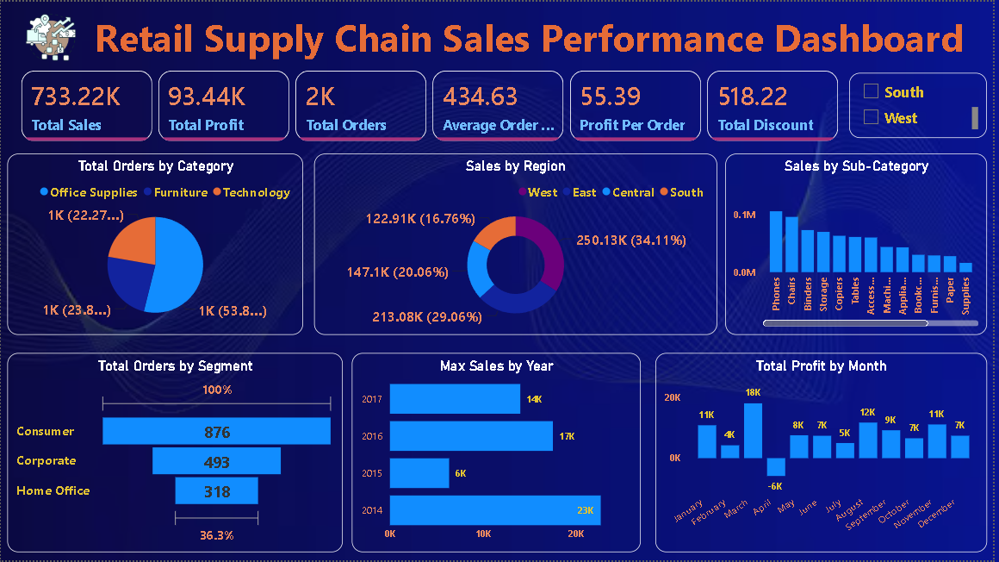

Retail Supply Chain Sales Performance Dashboard
--------
 
 This project provides an interactive Business Intelligence dashboard designed to analyze sales, profitability, customer segments, product performance, and regional sales trends within a retail supply chain.
 
------
📌 Project Overview

- The Retail Supply Chain Sales Performance Dashboard is an end-to-end Business Intelligence solution built with Power BI, SQL, Excel, Power Query, and DAX. It transforms raw retail sales data into a single interactive view of business performance, profitability, customer behavior, and regional trends — giving stakeholders a real-time lens into what's driving revenue and what isn't.
- Raw data was cleaned and shaped in Power Query, structured into a Star Schema data model, and layered with custom DAX measures to power key KPIs including Total Sales, Total Profit, Total Orders, Average Order Value, and Profit per Order. Beyond top-line numbers, the dashboard breaks performance down by product, customer segment, and region, surfacing where profitability is strongest and where it's leaking — insights that support faster, evidence-based decisions rather than static end-of-month reporting.

--------

📊 Key Performance Indicators
---
- 💰 Total Sales: 733.22K – Total revenue generated from all retail orders.
- 💵 Total Profit: 93.44K – Overall net profit earned across all transactions.
- 📦 Total Orders: 2K – Total number of customer orders processed.
- 🛒 Average Order Value: 434.63 – Average sales revenue generated per order.
- 📈 Profit per Order: 55.39 – Average profit earned from each order.
- 🎁 Total Discount: 518.22 – Total discount provided across all orders.

------

Tools & Technologies
--
- Power BI
- Excel/CSV Dataset
- Data cleaning
- Data Visualization
- Dax Measures
- SQL

---

🎯 Project Objectives
---
- Monitor monthly and yearly sales trends to support demand forecasting and strategic business planning.
- Enable stakeholders to make faster, data-driven decisions through interactive dashboards and real-time business insights.
- Improve reporting efficiency by transforming raw sales data into a structured and easy-to-understand Business Intelligence solution.
- Demonstrate end-to-end Data Analytics skills, including Data Cleaning, ETL, Data Modeling, DAX, SQL, and Dashboard Development.

---
📈 Key Business Insights
---

- 🌍 The West region contributed the highest share of sales, while other regions present opportunities for targeted marketing and expansion.
- 📱 Phones ranked among the top-performing sub-categories, highlighting strong customer demand for technology product
- 💰 The business generated ₹733.22K in total sales while achieving ₹93.44K in overall profit, indicating a healthy profit margin.
- 📦 More than 2,000 customer orders were analyzed, with an Average Order Value of ₹434.63, reflecting strong customer purchasing behavior.

💡 Solution
--

To solve these challenges, I developed an interactive Retail Supply Chain Sales Performance Dashboard using Power BI, SQL, Excel, Power Query, and DAX. The dashboard consolidates business data into a single executive view, enabling stakeholders to monitor ₹733.22K Total Sales, ₹93.44K Total Profit, 2K Customer Orders, and an Average Order Value of ₹434.63 through dynamic KPI cards and interactive visualizations. It provides real-time analysis across product categories, customer segments, regions, and time periods, helping decision-makers identify trends, measure business performance, and make faster, data-driven decisions.

## Dashboard Preview
-----

---
📬 Connect With Me
----
- 💼 Role : Aspiring Data Analyst
- 📧 Email :kumarshagun978@gmail.com
- 🔗 LinkedIn :https://www.linkedin.com/in/shagun-8544962a0/ 
- 📢 Open To Work  : Data Analyst | BI Analyst | Business Analyst
---
